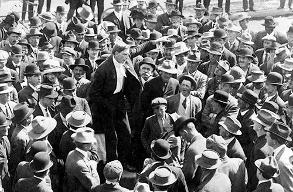

The following is an excerpt from “[Collective Action Behind Bars: A history of jail solidarity and its importance for today's social change movements](https://uppingtheanti.org/journal/article/18-collective-action-behind-bars), by Kris Hermes.”  

> San Diego soapbox during Free Speech Fight 1912. Image via [San Diego History Center](http://www.aftguild.org/free_speech/).

Beginning in 1908, Industrial Workers of the World (IWW) organizers (Wobblies) led an almost decade-long fight against the suppression of their right to speak out and organize. The most widely used tactic by the Wobblies was to strategically clog the local jails. Every Wobbly arrested for uttering the words, “Fellow workers and friends,” was replaced by another willing to risk arrest. In this way, the largely single male, unemployed and temporary workers were able to flood the local jails beyond capacity, placing considerable pressure on local political and legal systems.

> An IWW demonstration in New York City in 1914. Members of the Industrial Workers of the World (IWW), known as the Wobblies, gather together in a large crowd during a rally in Union Square, New York City, April 11, 1914. Image via Bain News Service/Interim Archives/Getty Images.

Labour historian Philip Foner claimed that, “Each Wobbly in jail demanded a separate trial by jury to clog the courts and administrative machinery.” As author and academic Matthew May explains, the jailed free speech fighters also engaged in hunger strikes and passive resistance techniques, such as refusing to do manual labour. According to May, many free speech fights were hailed as victories, including in Spokane, where “the union went from about 30 members to having about 3,000 members on the books in about 6 months.” The goal of repealing anti-free speech ordinances came at a significant cost, with many Wobblies being killed during the struggle.
