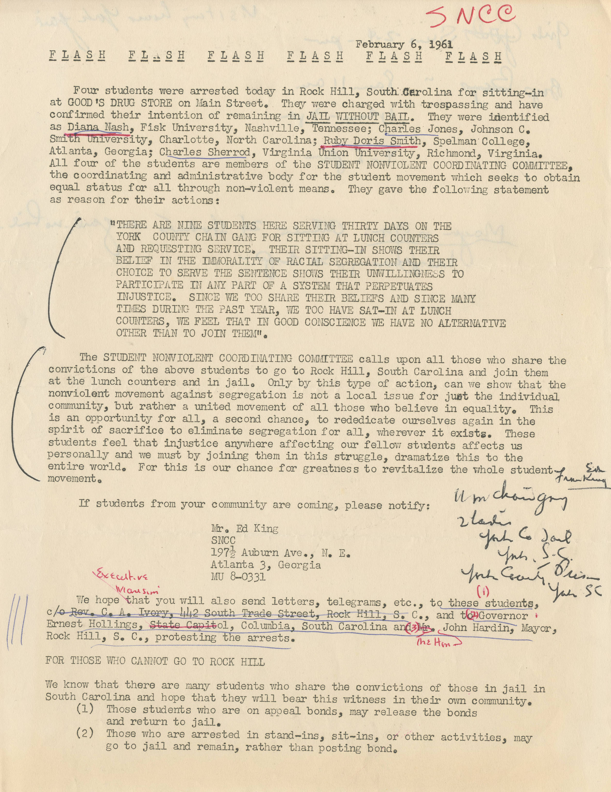
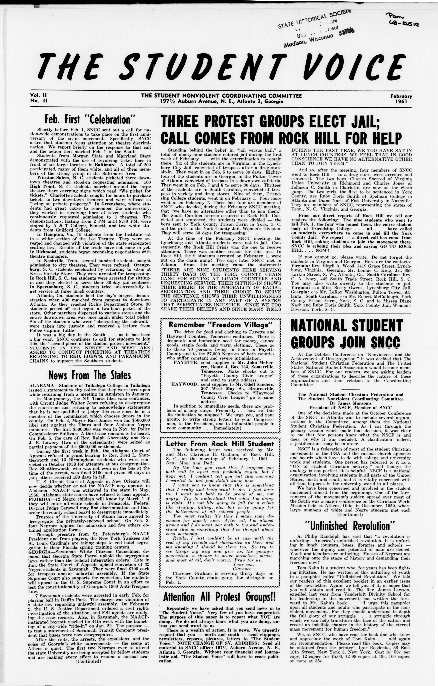
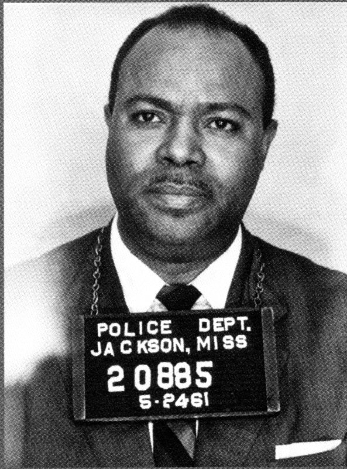

“Jail-no-bail” was a tactic thought up by the Student Nonviolent Coordinating Committee (SNCC) in 1960. The idea was that civil rights activists who were incarcerated pretrial or sentenced to serve time for participating in direct action like sit-ins would refuse to pay their way to freedom.

According to the SNCC’s digital archive, “Supporters believed it would ‘show the movement’s sincerity and win fresh media attention.’” Additionally, “as a practical matter, Jail-No-Bail also eased SNCC’s funding difficulties. The organization couldn’t afford thousands of dollars to bail people out and did not want to reinforce racist police departments with their bail money.”

> Press Release; Four Students Were Arrested in Rock Hill, South Carolina, for Sitting-In at Good’s Drug Store; February 6, 1961, Social Action Vertical File, WHS SAVF-Student Nonviolent Coordinating Committee (SNCC) (Social Action vertical file, circa 1930-2002; Archives Main Stacks, Mss 577, Box 47, Folder 13). Image via [Wisconsin Historical Society](http://content.wisconsinhistory.org/cdm/ref/collection/p15932coll2/id/66664).

This tactic debuted in 1961, following a sit-in where 10 African American students in Rock Hill, South Carolina were arrested for ordering food at a segregated lunch counter.

![A black and white pin-back button with text. In two arcs around the top and bottom edges of the button face are black blocks with white text. In the middle, centered, is black text. The text reads: [STUDENT NONVIOLENT / WE / SHALL / OVERCOME / COORDINATING / COMMITTEE]. On the reverse are two small white stickers. One is round with the number [225] and the other rectangular with two lines of text: [rear / 6936]. The revers has a pin with a fastener.](sncc-button.jpg)
> Student Non-violent Coordinating Committee pinback button that says, "we shall overcome." Image via the Collection of the Smithsonian National Museum of African American History and Culture.

Nine of the ten refused to bail out. In a statement at the time, they demanded jail time rather than bond, insisting that paying bail or fines indicates acceptance of and financial support for an immoral system, and validates their own arrests.

> “Three Protest Groups Elect Jail; Call Comes From Rock Hill for Help," The Student Voice, February 1961, WHS The Student voice (SNCC) (Historical Society Library Microforms Room, N71-508). Image via [Wisconsin Historical Society](http://content.wisconsinhistory.org/cdm/ref/collection/p15932coll2/id/66664).
 

Two months later, the [Freedom Rides](http://www.core-online.org/History/freedom%20rides.htm) embarked, testing a new Supreme Court ruling (Boynton vs. Virginia) that ordered buses and trains to be desegregated, and required interstate passengers to have equal access to any facilities served by the buses and trains. When the young activists reached Mississippi, more than 300 of them were arrested for enforcing Supreme Court law. They made use of jail-no-bail, filling up the local county jails. Most of the 300 riders in Jackson would endure six weeks in sweltering jail or prison cells rife with mice, insects, soiled mattresses and open toilets, according to [*Smithsonian*](https://www.smithsonianmag.com/history/the-freedom-riders-then-and-now-45351758/) **magazine. 

> Mugshot shot of freedom rider James Farmer Jr. Image via [Wikimedia](https://en.wikipedia.org/wiki/James_Farmer#/media/File:James_L_Farmer_Jr_mugsthot_1961.jpg).

Jail-no-bail was largely discontinued as a tactic by activists after the Freedom Rides, seen a “[strategy of last resort](https://www.crmvet.org/tim/timhis61.htm#1961rockhill)” due to the extreme violence faced by activists during incarceration. But none of the former freedom riders interviewed by Eric Etheridge, who published *Breach of Peace: Portraits of the 1961 Mississippi Freedom Riders*, said they regretted their experience, despite the dehumanization they experienced in jail. Some remained entangled for years in legal appeals that went all the way to the Supreme Court — which issued a ruling in 1965 that led to a reversal of the initial breach of peace convictions. 

